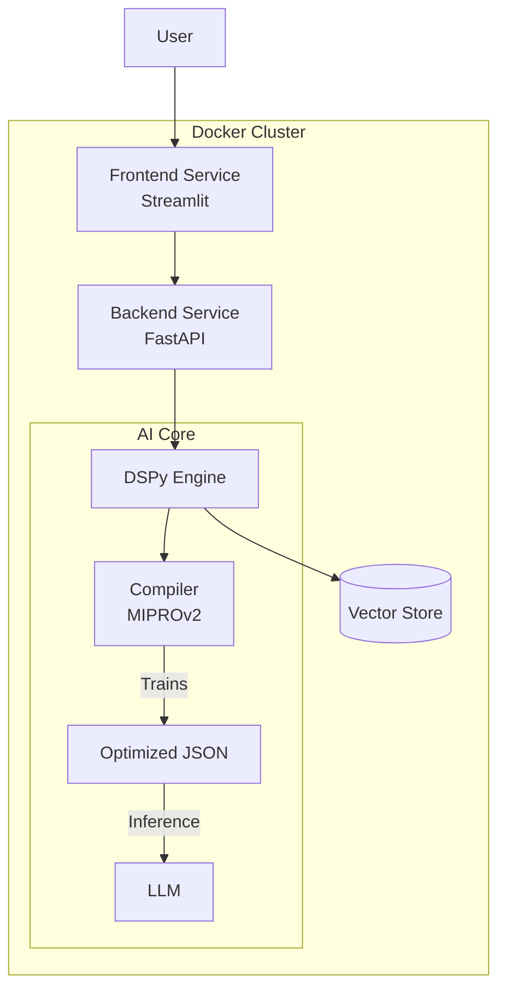

# 🎬 Scenarist: Eval-Driven Narrative Engine

a.k.a. Ghostwriter

### An autonomous agentic platform for consistent, high-fidelity narrative generation.
**Built with DSPy, FastAPI, and Docker.**


---

## 🚀 The Problem
Standard LLMs suffer from **Context Drift** and **Hallucination** when generating long-form content. They often forget established facts, ignore stylistic guidelines, or produce generic, "lazy" output.
Manual prompt engineering is brittle; changing one word in a prompt can break the entire pipeline.

## 🛠 The Solution: Compiled Logic > Prompt Engineering
Scenarist replaces fragile string manipulation with **DSPy (Declarative Self-Improving Python)**.
Instead of manually tweaking prompts, we define **Signatures** (Inputs/Outputs) and **Modules** (Logic). We then use an **Optimizer** (MIPROv2/BootstrapFewShot) to "compile" the best possible prompts by learning from a feedback metric.

**The Pipeline:**
1.  **Keyword Extraction:** Converts user intent into dramatic search queries.
2.  **RAG (Retrieval):** Fetches semantic references from a curated vector store.
3.  **Chain-of-Thought:** The agent plans the scene structure (Beats, Characters, Subtext) *before* generation.
4.  **Auto-Critique:** A separate "Judge" model evaluates the draft against a rubric.
5.  **Optimization Loop:** The system learns from its best outputs, automatically injecting successful few-shot examples into future prompts.

## 🏗 Architecture



## ✨ Key Features

* **Self-Optimizing Prompts:** The system improves its own instructions by compiling successful traces into the prompt context.
* **Microservices Architecture:** Fully containerized backend (FastAPI) and frontend (Streamlit) orchestrated via Docker Compose.
* **Structured Outputs:** Enforced strict JSON schemas for predictable downstream integration.
* **Local-First Design:** Optimized to run with local models (Ollama/Llama-3) or OpenAI, interchangeable via environment variables.

## 📂 Project Structure

```text
scenarist/
├── app/                 # Backend Service
│   ├── main.py          # FastAPI Entrypoint
│   └── engine.py        # DSPy Logic & Signatures
├── ui/                  # Frontend Service
│   └── app.py           # Streamlit Interface
├── data/                # Artifacts
│   └── scenarist_v1.json # The Compiled/Optimized Model
├── docker-compose.yml   # Orchestration
└── Dockerfile           # Multi-stage build definition

```

## ⚡️ Quick Start

### Prerequisites

* Docker & Docker Compose
* Local Ollama instance with `gpt-oss:20b` and `nomic-embed-text` models
* OpenAI API Key

### Installation & Run

No need to install Python dependencies manually. The entire stack is containerized.

```bash
# 1. Clone the repo
`git clone [https://github.com/keremistan/scenarist.git](https://github.com/keremistan/scenarist.git)
cd scenarist`

# 2. Configure Environment
Rename .env.example to .env and add your keys
Keys to be updated are marked with "#UPDATE"

# 3. Launch the Platform
`docker compose up --build`

# Optional, but preferred
# 4. If you want to use langfuse, 
Go to the localhost:3000
and 'signup' to generate a public and secret key
paste them into the .env file

# 5. Restart the docker compose
Everything should be working now (streamlit ui, fastapi backend and langfuse)


```

**Access the Application:**

* **Frontend:** `http://localhost:8501`
* **API Docs:** `http://localhost:8000/docs`

## 🔮 Roadmap

* [x] **Phase 1: Architecture** (DSPy Implementation, Dockerization)
* [x] **Phase 2: Observability** (Langfuse Integration for Tracing & Cost Tracking)
* [ ] **Phase 3: Advanced RAG** (Hybrid Search with Cross-Encoder Re-ranking)
* [ ] **Phase 4: Fine-Tuning** (Distilling the DSPy agent into a custom Llama-3-8B model)
